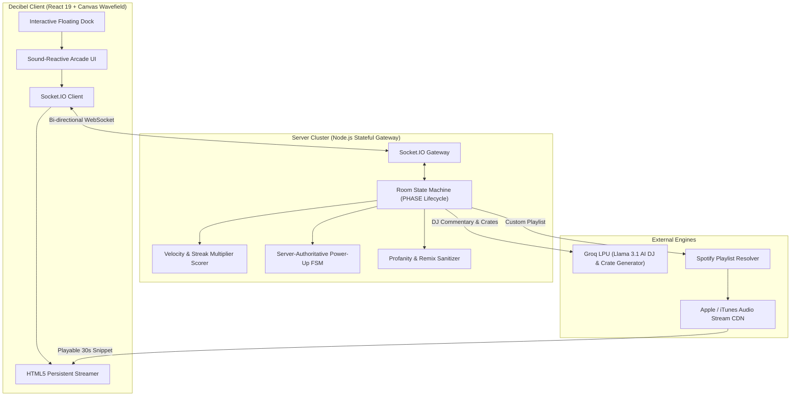

<div align="center">

```
  ██████╗ ███████╗ ██████╗██╗██████╗ ███████╗██╗     
  ██╔══██╗██╔════╝██╔════╝██║██╔══██╗██╔════╝██║     
  ██║  ██║█████╗  ██║     ██║██████╔╝█████╗  ██║     
  ██║  ██║██╔══╝  ██║     ██║██╔══██╗██╔══╝  ██║     
  ██████╔╝███████╗╚██████╗██║██████╔╝███████╗███████╗
  ╚═════╝ ╚══════╝ ╚═════╝╚═╝╚═════╝ ╚══════╝╚══════╝
```

### The Real-Time Multiplayer Music Battleground & Crate Trivia Arena
*Built for audiophiles, crate diggers, speed demons, and competitive room battles.*

---

[](https://react.dev)
[](https://nodejs.org)
[](https://socket.io)
[-F55036?style=for-the-badge&logo=fastapi&logoColor=white)](https://groq.com)
[](https://supabase.com)
[](https://vitest.dev)

<p align="center">
  <b>Decibel</b> is an ultra-low latency, server-authoritative live music trivia platform.<br>
  Hear 10-second studio audio cuts, race the clock in real-time multiplayer rooms across 11 curated music scenes, battle on custom Spotify playlists, prompt custom AI crates with Groq, deploy tactical power-ups, and get hyped by an AI live host.
</p>

</div>

---

## ⚡ What is Decibel?

Decibel re-imagines competitive music gaming. No lag, no duplicate remix filler, no boring multiple-choice quizzes. Just pure speed, authentic crate curation, and electric arcade energy.

```text
┌────────────────────────────────────────────────────────────────────────┐
│  DECIBEL // ROUND 04/10 ────────── TIME REMAINING: 07.4s ───────────── │
├────────────────────────────────────────────────────────────────────────┤
│                                                                        │
│   [AUDIO STREAMING] ılı.lıllılı.ıllı.lı.ılıllılı.ıllı [BITRATE: 256K]  │
│   GENRE: DESI HIP HOP  •  VIBE: MAINSTREAM  •  MODE: TITLE             │
│                                                                        │
│   ┌─────────────────────────────────┐ ┌──────────────────────────────┐ │
│   │ [1] Untitled                    │ │ [2] Shaktimaan               │ │
│   │     KR$NA                       │ │     Seedhe Maut              │ │
│   ├─────────────────────────────────┤ ├──────────────────────────────┤ │
│   │ [3] LOVESEXDHOKA!!!             │ │ [4] Afsanay                  │ │
│   │     Chaar Diwaari               │ │     Young Stunners           │ │
│   └─────────────────────────────────┘ └──────────────────────────────┘ │
│                                                                        │
│   MODIFIERS: [ 💣 50:50 (1x) ]  [ ⚡ 2X BET (1x) ]  [ 🛡️ SHIELD (1x) ] │
│                                                                        │
│   LEADERBOARD (LIVE):                                                  │
│   1UP  CHITTRANSH    4,850 PTS  (🔥 STREAK x4)                         │
│   2UP  CRATE_DIGGER  4,120 PTS  (🔥 STREAK x2)                         │
│   3UP  SYNTH_WAVE    3,400 PTS  (• STREAK x1)                          │
└────────────────────────────────────────────────────────────────────────┘
```

---

## 🌟 Key Features

### 🎧 1. 78,000+ Track Catalog Across 11 Curated Scenes
Hand-curated, authentic rosters spanning mainstream hits to underground cult cuts:
- **Desi Hip Hop**: Seedhe Maut, KR$NA, MC Stan, Young Stunners, Chaar Diwaari, Talha Anjum, MC Amrit, Dhanji, Rawal, Prabh Deep.
- **Modern Hip-Hop**: Kendrick Lamar, Drake, J. Cole, Travis Scott, JID, Denzel Curry, 21 Savage.
- **Old School Rap**: 2Pac, Biggie, Wu-Tang Clan, Nas, MF DOOM, Mos Def, Rakim, Outkast.
- **Trap & Rage**: Playboi Carti, Yeat, Ken Carson, Destroy Lonely, Future, Young Thug, Metro Boomin.
- **Hyperpop & Digicore**: Charli XCX, 100 gecs, SOPHIE, Bladee, Ecco2k, Jane Remover, Brakence.
- **Rock & Alt**: Nirvana, Queen, Arctic Monkeys, Radiohead, Linkin Park, Red Hot Chili Peppers, The Strokes.
- **Indie & Alt**: Tame Impala, Phoebe Bridgers, boygenius, Elliott Smith, Mac DeMarco, TV Girl.
- **Bedroom Pop**: Clairo, Rex Orange County, Boy Pablo, Men I Trust, Dominic Fike, Cavetown.
- **R&B & Soul**: Frank Ocean, SZA, The Weeknd, Brent Faiyaz, Daniel Caesar, Kelela, Sampha.
- **Pop & Dance**: Taylor Swift, Billie Eilish, Dua Lipa, Sabrina Carpenter, Olivia Rodrigo, Chappell Roan.
- **Desi Indie**: Prateek Kuhad, Anuv Jain, The Local Train, When Chai Met Toast, Peter Cat Recording Co., Lifafa.

### 🛡️ 2. 100% Clean Studio Cuts (Zero Remix Junk)
Universal multi-tier audio sanitization automatically filters out remixes, club edits, live concert bootlegs, acoustic versions, sped-up, and slowed+reverb tracks. Only pristine, original studio recordings make the cut.

### 🟢 3. Custom Spotify Playlist Battles
Paste any public Spotify playlist URL or URI. Decibel extracts full track metadata and resolves playable 30-second audio previews on the fly so you can battle friends on your exact music taste.

### 🪄 4. AI Vibe Crates (Groq LPU Engine)
Type any mood, scene, or aesthetic prompt (e.g. *"90s Tokyo midnight drift"*, *"lo-fi rainy coffee shop in Paris"*). The Groq AI engine generates a custom curated trivia crate in milliseconds.

### 🎙️ 5. Live AI DJ Commentary ("DJ Decibel")
High-speed LLM commentary delivers real-time match hype, roasts slow answers, and crowns the podium champions upon match completion.

### 💣 6. Tactical In-Game Power-Ups
- **💣 50:50 Eliminator**: Strips 2 incorrect distractor choices. Correct answer is server-guaranteed safe.
- **⚡ 2X Double Down**: Multiplies base round points and speed bonus by $2\times$.
- **🛡️ Streak Shield**: Protects active answer streaks from breaking on wrong guesses.

### 🎮 7. Standalone Solo Arcade Suite
- **🎵 Harmonies**: 4x4 musical connections grouping puzzle.
- **🔤 Wordzic**: 5-letter daily music term guesser.
- **📜 Lyricles**: Timed rapid-fire lyric identification.
- **🧩 Crosszic**: 5x5 interactive music crossword.
- **▶️ Heardle**: Guess the song from its opening seconds.

---

## 🧮 Mathematical Scoring Engine

Scores are calculated deterministically server-side using monotonic high-resolution clocks:

$$\text{FinalScore} = \text{round}\left( \Big( \text{BasePoints}(r) + \text{VelocityBonus}(t_a, T) \Big) \times \text{StreakMultiplier}(s) \right) \times \text{DoubleDown}$$

- **Escalating Base Points**: $\text{BasePoints}(r) = 300 + (r \times 250)$
- **Velocity Bonus**: $\text{VelocityBonus}(t_a, T) = \text{round}\left( 350 \times \left(1 - \frac{\text{clamp}(t_a, 0, T)}{T}\right) \right)$
- **Streak Multipliers**: Up to $1.4\times$ combo boost for consecutive fast answers.

---

## 🛡️ Anti-Cheat & Engineering Architecture



- **Zero Client Answer Exposure**: Answers exist strictly on the server until `ROUND_REVEAL`.
- **Opaque Audio Hashes**: Stream URLs contain no song/artist metadata in network inspection payloads.
- **Monotonic Server Timestamps**: Neutralizes client clock tampering.
- **Sliding-Window Rate Limiting**: Protects against automated bots and rapid brute-force guessing.

---

## 🧪 Quality & Test Suite

Decibel is tested and verified with **62 automated unit and integration tests** via Vitest:

```text
 ✓ test/profanity.test.js (6 tests)
 ✓ test/itunesFetcher.test.js (8 tests)
 ✓ test/spotifyFetcher.test.js (4 tests)
 ✓ test/gameLogic.test.js (14 tests)
 ✓ test/groqService.test.js (5 tests)
 ✓ test/puzzles.test.js (5 tests)
 ✓ test/catalog.test.js (20 tests)

 Test Files  7 passed (7)
      Tests  62 passed (62)
```

---

## 📄 License & Credits

Built with ❤️ by **[Chittransh Sharma](https://github.com/chittranshsharma)**.  
All music previews are served via authorized CDN previews strictly for trivia identification under fair use.  
All rights reserved © 2026.
