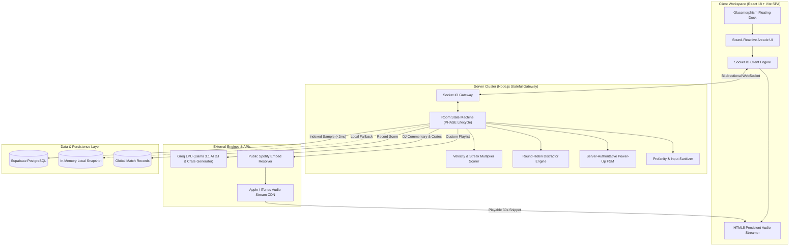

<div align="center">

```
  ██████╗ ███████╗ ██████╗██╗██████╗ ███████╗██╗     
  ██╔══██╗██╔════╝██╔════╝██║██╔══██╗██╔════╝██║     
  ██║  ██║█████╗  ██║     ██║██████╔╝█████╗  ██║     
  ██║  ██║██╔══╝  ██║     ██║██╔══██╗██╔══╝  ██║     
  ██████╔╝███████╗╚██████╗██║██████╔╝███████╗███████╗
  ╚═════╝ ╚══════╝ ╚═════╝╚═╝╚═════╝ ╚══════╝╚══════╝
```

### Ultra-Low Latency Multiplayer Audio Trivia, AI Live DJ & Crate Engine
*Engineered for audiophiles, crate diggers, speed demons, and competitive room matches.*

---

[](https://nodejs.org)
[](https://react.dev)
[](https://socket.io)
[](https://supabase.com)
[-F55036?style=for-the-badge&logo=fastapi&logoColor=white)](https://groq.com)
[](https://vitest.dev)
[](LICENSE)

<p align="center">
  <b>Decibel</b> is a high-frequency, server-authoritative multiplayer music guessing engine.<br>
  Compete live in 30-second audio battles across 11 culturally authentic genre crates, scrape Spotify playlists in real-time, generate custom crates with natural-language Groq AI prompts, deploy in-game power-ups, and enjoy live AI DJ commentary.
</p>

---

</div>

## 📑 Table of Contents

- [⚡ Core Highlights](#-core-highlights)
- [🎙️ AI Live Hype DJ & Natural Language Crate Engine](#️-ai-live-hype-dj--natural-language-crate-engine)
- [💣 Arcade Modifiers & Power-Up System](#-arcade-modifiers--power-up-system)
- [🎮 Daily Solo Arcade Hub](#-daily-solo-arcade-hub)
- [🕹️ Live Gameplay Interface](#️-live-gameplay-interface)
- [🏛️ High-Level Architecture](#️-high-level-architecture)
- [🎵 11 Curated Genres & Scene Rosters](#-11-curated-genres--scene-rosters)
- [🎛️ Vibe Tier Selector (Mainstream vs. Underground)](#️-vibe-tier-selector-mainstream-vs-underground)
- [🟢 Keyless Spotify Playlist Ingestion](#-keyless-spotify-playlist-ingestion)
- [🧮 Mathematical Scoring Engine](#-mathematical-scoring-engine)
- [📊 Database Architecture & Dual Storage Pipeline](#-database-architecture--dual-storage-pipeline)
- [🔌 WebSocket Wire Protocol Specification](#-websocket-wire-protocol-specification)
- [🛡️ Anti-Cheat & Security Guarantees](#️-anti-cheat--security-guarantees)
- [🚀 Quickstart & Local Setup](#-quickstart--local-setup)
- [🧪 Test Suite & Quality Verification](#-test-suite--quality-verification)
- [⚙️ Environment Configuration](#️-environment-configuration)
- [📄 License & Credits](#-license--credits)

---

## ⚡ Core Highlights

- **🛡️ 100% Server-Authoritative FSM**: Track metadata, answers, audio synchronization timestamps, power-up states, and monotonic clocks are guarded strictly on the backend.
- **🎙️ Groq LPU AI Host ("DJ Decibel")**: Ultra-fast LLM inference delivers snappy, contextual commentary between rounds and comprehensive match verdicts upon game over.
- **🪄 Prompt-to-Crate Engine**: Type any vibe, scene, or mood (e.g., *"90s Tokyo midnight drift"*) to generate instant curated audio crates powered by Groq and Apple Search CDN.
- **💣 Arcade Power-Ups**: Single-charge tactical modifiers per match including **50:50 Eliminator** (server-safe), **2X Double Down** multiplier, and **Streak Shield**.
- **🎮 Solo Puzzle Suite**: Four standalone daily audio games: **Harmonies** (Connections), **Wordzic** (Wordle), **Lyricles** (timed lyrics), and **Crosszic** (music crossword).
- **🎧 11 Deep Curation Genres**: Spanning Modern Hip-Hop, Old School Rap, Trap & Rage, Hyperpop & Digicore, Desi Hip Hop, Rock & Alt, Indie, Bedroom Pop, R&B & Soul, Mainstream Pop, and Desi Indie.
- **🎛️ Vibe Selector**: Granularly toggle between **Mainstream** (chart titans) and **True Underground** (scene deep cuts, bandcamp staples, cult acts).
- **🟢 Keyless Spotify Playlist Ingest**: Scrapes public Spotify playlists via embed metadata, concurrently resolving high-bitrate playable audio snippets.
- **📊 500k-Scale Database Engine**: Supabase PostgreSQL storage with indexed random sampling and automatic local JSON snapshot fallback.

---

## 🎙️ AI Live Hype DJ & Natural Language Crate Engine

Decibel integrates ultra-fast **Groq LPU inference** (`llama-3.1-8b-instant`) to bring matches alive with zero latency penalties:

```
                  ┌────────────────────────────────────────────────────────┐
                  │                 GROQ AI INFERENCE HUB                  │
                  └───────────────────────────┬────────────────────────────┘
                                              │
                    ┌─────────────────────────┴─────────────────────────┐
                    ▼                                                   ▼
       ┌─────────────────────────┐                         ┌─────────────────────────┐
       │   🎙️ DJ LIVE COMMENTARY  │                         │   🪄 PROMPT-TO-CRATE     │
       ├─────────────────────────┤                         ├─────────────────────────┤
       │ • Roasts & Hype at      │                         │ • Natural language input│
       │   ROUND_REVEAL          │                         │ • Contextual seed maps  │
       │ • Fastest reaction time │                         │ • Direct 30s preview    │
       │ • Streak shoutouts      │                         │   stream generation     │
       │ • Final Match Verdict   │                         │ • Instant lobby inject  │
       └─────────────────────────┘                         └─────────────────────────┘
```

---

## 💣 Arcade Modifiers & Power-Up System

Players have **1 single charge per modifier** per match session to turn the tide:

| Modifier | Icon | Behavior | Server Invariant |
| :--- | :---: | :--- | :--- |
| **50:50 Eliminator** | 💣 | Removes 2 incorrect distractor options from the grid. | Server calculates elimination set; **correct answer is mathematically impossible to eliminate**. |
| **2X Double Down** | ⚡ | Multiplies base question value and speed bonus by $2\times$ for the current round. | Evaluated server-side at round resolution. Wrong answer yields 0 points. |
| **Streak Shield** | 🛡️ | Prevents active combo streak from resetting on a wrong guess or timeout. | Consumed only if the player fails to answer correctly. |

---

## 🎮 Daily Solo Arcade Hub

Beyond multiplayer rooms, Decibel features 4 dedicated solo audio games accessible via the floating dock:

```
 ┌─────────────────┐ ┌─────────────────┐ ┌─────────────────┐ ┌─────────────────┐
 │   🎵 HARMONIES  │ │    🔤 WORDZIC   │ │   📜 LYRICLES   │ │   🧩 CROSSZIC   │
 ├─────────────────┤ ├─────────────────┤ ├─────────────────┤ ├─────────────────┤
 │ Find 4 groups   │ │ Guess 5-letter  │ │ Fast-paced timed│ │ Musical artists │
 │ of 4 related    │ │ musical words & │ │ lyric fill-in-  │ │ and terminology │
 │ artists/genres. │ │ track titles.   │ │ the-blanks.     │ │ mini crossword. │
 └─────────────────┘ └─────────────────┘ └─────────────────┘ └─────────────────┘
```

---

## 🕹️ Live Gameplay Interface

```text
┌────────────────────────────────────────────────────────────────────────┐
│  DECIBEL // ROUND 04/10 ────────── TIME REMAINING: 07.4s ───────────── │
├────────────────────────────────────────────────────────────────────────┤
│                                                                        │
│   [AUDIO STREAMING] ılı.lıllılı.ıllı.lı.ılıllılı.ıllı [BITRATE: 256K]  │
│   GENRE: DESI HIP HOP  •  VIBE: MAINSTREAM  •  MODE: TITLE             │
│                                                                        │
│   ┌─────────────────────────────────┐ ┌──────────────────────────────┐ │
│   │ [1] Untitled                    │ │ [2] Shaktimaan               │ │
│   │     KR$NA                       │ │     Seedhe Maut              │ │
│   ├─────────────────────────────────┤ ├──────────────────────────────┤ │
│   │ [3] LOVESEXDHOKA!!!             │ │ [4] Afsanay                  │ │
│   │     Chaar Diwaari               │ │     Young Stunners           │ │
│   └─────────────────────────────────┘ └──────────────────────────────┘ │
│                                                                        │
│   MODIFIERS: [ 💣 50:50 (1x) ]  [ ⚡ 2X BET (1x) ]  [ 🛡️ SHIELD (1x) ] │
│                                                                        │
│   LEADERBOARD (LIVE):                                                  │
│   1UP  CHITTRANSH    4,850 PTS  (🔥 STREAK x4)                         │
│   2UP  CRATE_DIGGER  4,120 PTS  (🔥 STREAK x2)                         │
│   3UP  SYNTH_WAVE    3,400 PTS  (• STREAK x1)                          │
└────────────────────────────────────────────────────────────────────────┘
```

---

## 🏛️ High-Level Architecture



---

## 🎵 11 Curated Genres & Scene Rosters

Rosters are curated to ensure genuine cultural accuracy across all tiers:

| Genre Key | Display Label | Mainstream Roster Highlights | True Underground / Scene Highlights |
| :--- | :--- | :--- | :--- |
| `desi-hip-hop` | **Desi Hip Hop** | KR$NA, Seedhe Maut, MC Stan, Talha Anjum, Talhah Yunus, Ikka, King, Young Stunners, Raga, Arpit Bala, Chaar Diwaari, Nanku, Karun, Yashraj, Rawal, Prabh Deep, Ahmer, Siyaahi, Dhanji | Prathamesh, Naam Sujal, Vichaar, Shauharty, MC Altaf, Frappe Ash, The Siege, Bagi Munda, Darcy, Qaab, Sikander Kahlon, SOS, Wolf.Cryman, Tienas, Farhan Khan, DRV, Panther, Bharg |
| `hip-hop` | **Modern Hip-Hop** | Kendrick Lamar, Drake, J. Cole, Travis Scott, JID, JPEGMAFIA, Denzel Curry, Mac Miller, 21 Savage, Tyler The Creator | Billy Woods, Armand Hammer, Mach-Hommy, Rome Streetz, Boldy James, MIKE, MAVI, Pink Siifu, Ka, Roc Marciano |
| `oldschool-hiphop` | **Old School Rap** | 2Pac, Biggie, Wu-Tang Clan, Nas, MF DOOM, Mos Def, Big L, Mobb Deep, Rakim, Outkast, A Tribe Called Quest | Jeru the Damaja, Kool G Rap, Camp Lo, Smif-N-Wessun, O.C., Company Flow, Cannibal Ox, Non Phixion |
| `trap` | **Trap & Rage** | Playboi Carti, Yeat, Ken Carson, Destroy Lonely, Future, Young Thug, 21 Savage, Lil Uzi Vert, Metro Boomin | Lucki, Summrs, Autumn!, Kankan, Homixide Gang, UnoTheActivist, Black Kray, SpaceGhostPurrp, Duwap Kaine |
| `hyperpop` | **Hyperpop & Digicore** | Charli XCX, 100 gecs, SOPHIE, Bladee, Ecco2k, Thaiboy Digital, 2hollis, Jane Remover, Brakence, Glaive | Underscores, Midwxst, Aldn, Sebii, Blackwinterwells, Osquinn, Dltzk, Frost Children, Snow Strippers |
| `rock` | **Rock & Alt Rock** | Queen, Nirvana, Linkin Park, Radiohead, Smashing Pumpkins, Jeff Buckley, The Smiths, Foo Fighters, Green Day | Black Country New Road, Fontaines D.C., King Gizzard, IDLES, Slint, Swans, Turnstile, Duster, Panchiko |
| `indie` | **Indie & Alt** | Arctic Monkeys, The Strokes, Tame Impala, Phoebe Bridgers, boygenius, Elliott Smith, Lorde, Lana Del Rey | Car Seat Headrest, Alvvays, Alex G, Big Thief, Sufjan Stevens, MJ Lenderman, Water From Your Eyes |
| `bedroom-pop` | **Bedroom & Dream Pop** | Clairo, Rex Orange County, Boy Pablo, TV Girl, The Marías, Men I Trust, Mac DeMarco, Dominic Fike | Crumb, Current Joys, Eyedress, Vansire, TEMPOREX, Monsune, Goth Babe, Strawberry Guy, Far Caspian |
| `rnb` | **R&B & Soul** | SZA, Frank Ocean, The Weeknd, Brent Faiyaz, Daniel Caesar, Kelela, Sampha, FKA twigs, Omar Apollo | Ravyn Lenae, Dijon, Mk.gee, Rochelle Jordan, Cleo Sol, SAULT, Choker, Sudan Archives, Arlo Parks |
| `pop` | **Mainstream Pop** | Taylor Swift, Billie Eilish, Dua Lipa, Sabrina Carpenter, Olivia Rodrigo, Chappell Roan, Ariana Grande | Magdalena Bay, Remi Wolf, Allie X, Yeule, Sky Ferreira, Ethel Cain, Maisie Peters, The Japanese House |
| `desi-indie` | **Desi Indie & Alt** | Prateek Kuhad, Anuv Jain, The Local Train, When Chai Met Toast, Lifafa, Peter Cat Recording Co., Sanam | Begum, Tejas, Dhrruv, Bawari Basanti, Taba Chake, Thermal And A Quarter, Bloodywood, Gauley Bhai |

---

## 🎛️ Vibe Tier Selector (Mainstream vs. Underground)

Hosts can tailor match difficulty and curation style in the room lobby:

```
                  ┌────────────────────────────────────────┐
                  │          VIBE SELECTION ENGINE         │
                  └───────────────────┬────────────────────┘
                                      │
              ┌───────────────────────┼───────────────────────┐
              ▼                       ▼                       ▼
      ┌───────────────┐       ┌───────────────┐       ┌───────────────┐
      │   ALL (50/50) │       │   MAINSTREAM  │       │  UNDERGROUND  │
      ├───────────────┤       ├───────────────┤       ├───────────────┤
      │ Balanced mix  │       │ Recognizable  │       │ Deep cuts,    │
      │ of hits and   │       │ anthems &     │       │ B-sides &     │
      │ hidden gems   │       │ scene bangers │       │ cult classics │
      └───────────────┘       └───────────────┘       └───────────────┘
```

---

## 🟢 Keyless Spotify Playlist Ingestion

Paste any public Spotify playlist URL into the lobby. Decibel extracts tracks on the fly and resolves direct playable audio:

```
[ Host Pastes Spotify URL ] ──> [ spotifyFetcher.js: parseSpotifyPlaylistId ]
                                                │
                                                ▼
                                [ Scrape Spotify Embed Metadata Payload ]
                                                │
                                                ▼
                                [ Extract Array<{ title, artist }> ]
                                                │
                                                ▼ (Concurrent Promise Pool)
                                [ Query Apple/iTunes Search API ]
                                                │
                                                ▼
                              [ Resolve Direct 30s Audio Stream URLs ]
                                                │
                                                ▼
                           [ Cache In-Memory & Inject into Room Pool ]
```

---

## 🧮 Mathematical Scoring Engine

Decibel computes deterministic velocity scores server-side:

$$\text{FinalScore} = \text{round}\left( \Big( \text{BasePoints}(r) + \text{VelocityBonus}(t_a, T) \Big) \times \text{StreakMultiplier}(s) \right) \times \text{DoubleDown}$$

### 1. Escalating Base Points
$$\text{BasePoints}(r) = 300 + (r \times 250)$$
*Where $r \in [0, \text{rounds}-1]$ represents the round index.*

### 2. Linear Velocity Bonus
$$\text{VelocityBonus}(t_a, T) = \text{round}\left( 350 \times \left(1 - \frac{\text{clamp}(t_a, 0, T)}{T}\right) \right)$$
*Where $t_a$ is the monotonic answer elapsed time in ms and $T$ is the total round duration.*

### 3. Streak Multiplier Curve
- **1 Correct Answer**: $1.0\times$
- **2 Correct Answers**: $1.1\times$
- **3 Correct Answers**: $1.2\times$
- **4 Correct Answers**: $1.3\times$
- **5+ Correct Answers**: $1.4\times$ (Max Tier)

---

## 📊 Database Architecture & Dual Storage Pipeline

Decibel uses Supabase PostgreSQL with a self-healing in-memory JSON fallback (`catalog/snapshot.json`):

```sql
CREATE TABLE IF NOT EXISTS catalog_tracks (
  track_id     TEXT PRIMARY KEY,
  track_name   TEXT NOT NULL,
  artist_name  TEXT NOT NULL,
  artist_id    TEXT,
  preview_url  TEXT NOT NULL,
  apple_genre  TEXT,
  genre_keys   TEXT[] NOT NULL,
  release_year INTEGER,
  duration_ms  INTEGER,
  base_title   TEXT,
  random_seed  FLOAT NOT NULL DEFAULT random(),
  updated_at   TIMESTAMPTZ NOT NULL DEFAULT now()
);

CREATE INDEX IF NOT EXISTS catalog_tracks_genre_idx ON catalog_tracks USING GIN (genre_keys);
CREATE INDEX IF NOT EXISTS catalog_tracks_year_idx  ON catalog_tracks (release_year);
CREATE INDEX IF NOT EXISTS catalog_tracks_seed_idx  ON catalog_tracks (random_seed);
```

---

## 🔌 WebSocket Wire Protocol Specification

| Event | Origin | Direction | Description |
| :--- | :--- | :--- | :--- |
| `createRoom` | Client | $\rightarrow$ Server | Initializes new room state machine and claims Host role. |
| `joinRoom` | Client | $\rightarrow$ Server | Joins existing room (as player during Lobby; spectator during match). |
| `startGame` | Host | $\rightarrow$ Server | Initiates round 1 with selected genre, vibe, and duration settings. |
| `countdown` | Server | $\rightarrow$ Room | Broadcasts 3-second animated start overlay with round point stakes. |
| `roundStart` | Server | $\rightarrow$ Room | Triggers audio playback and unlocks client option grids. |
| `fiftyFifty` | Client | $\rightarrow$ Server | Requests 50:50 power-up (returns 2 safe eliminated wrong options). |
| `guess` | Client | $\rightarrow$ Server | Submits single player answer with monotonic timestamp calculation. |
| `reveal` | Server | $\rightarrow$ Room | Discloses correct answer, score deltas, fastest reaction, & AI DJ hype. |
| `gameOver` | Server | $\rightarrow$ Room | Broadcasts final podium, match statistics, and AI match summary. |
| `generateAiVibe` | Host | $\rightarrow$ Server | Prompts Groq to generate a themed crate with audio previews. |

---

## 🛡️ Anti-Cheat & Security Guarantees

1. **Zero Client Answer Exposure**: The correct answer key is strictly held in memory on the server and is never sent over WebSockets until `ROUND_REVEAL`.
2. **Opaque Audio Stream Hashes**: Audio preview URLs are served as raw CDN hashes containing no artist or title information in the network payload.
3. **Monotonic Clocks**: Answer timings are calculated using server delta timestamps ($t_{\text{server}} - t_{\text{start}}$), neutralizing client clock tampering.
4. **Sliding-Window Rate Limiting**: All socket events (guesses, chats, reactions, matchmaking) are governed by per-socket sliding rate limiters.

---

## 🚀 Quickstart & Local Setup

### Prerequisites
- Node.js v20+
- npm / yarn / pnpm

```bash
# 1. Clone repository
git clone https://github.com/chittranshsharma/decibel.git
cd decibel

# 2. Install dependencies (root & client)
npm install
npm --prefix client install

# 3. Configure environment
cp .env.example .env

# 4. Start concurrent development cluster
npm run dev
# In a separate terminal:
npm --prefix client run dev
```

Visit `http://localhost:5173` to play!

---

## 🧪 Test Suite & Quality Verification

Decibel maintains a thorough test suite powered by **Vitest**:

```bash
# Run unit & integration tests
npm test
```

```text
 ✓ test/profanity.test.js (6 tests)
 ✓ test/puzzles.test.js (4 tests)
 ✓ test/groqService.test.js (5 tests)
 ✓ test/itunesFetcher.test.js (8 tests)
 ✓ test/spotifyFetcher.test.js (4 tests)
 ✓ test/gameLogic.test.js (12 tests)
 ✓ test/catalog.test.js (20 tests)

 Test Files  7 passed (7)
      Tests  59 passed (59)
```

---

## ⚙️ Environment Configuration

| Variable | Required | Default | Description |
| :--- | :---: | :--- | :--- |
| `PORT` | No | `3000` | Stateful WebSocket & HTTP server port |
| `CLIENT_ORIGIN` | No | `http://localhost:5173` | Allowed CORS origin |
| `DATABASE_URL` | No | `""` | Supabase / PostgreSQL connection pool string |
| `GROQ_API_KEY` | Recommended | `""` | Groq LPU API key for DJ commentary & AI crates |
| `GROQ_MODEL` | No | `llama-3.1-8b-instant` | Groq model for low-latency completions |
| `CATALOG_FILE` | No | `./catalog/snapshot.json` | Local fallback catalog snapshot path |

---

## 📄 License & Credits

Built with ❤️ by **[Chittransh Sharma](https://github.com/chittranshsharma)**.  
Licensed under the [MIT License](LICENSE).
